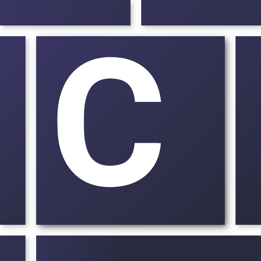

![Build][build-shield]
![Deploy][deploy-shield]
[![Website status][website-shield]][main-url]
[![GitHub issues][issues-shield]][issues-url]
[![GPLv3 License][license-shield]][license-url]
[![Ask Me Anything !][ama-shield]][email-link]
![Open Source? Yes!][os-shield]

<!-- PROJECT LOGO -->
<br />
<p align="center">
  <a href="https://coderush.xyz">
    
  </a>

  <h1 align="center">CodeRush</h1>

  <p align="center">
    The best typing speed test for programmers
    <br />
    <br />
    <a href="https://coderush.xyz">View Live</a>
    ·
    <a href="https://github.com/encap/coderush/issues">Report Bug</a>
    ·
    <a href="https://github.com/encap/coderush/issues">Request a Feature</a>
    ·
    <a href="https://paypal.me/encap">Donate</a>
  </p>
</p>

<!-- TABLE OF CONTENTS -->
## Table of Contents

* [About the Project](#about-the-project)
  * [Built With](#built-with)
* [Getting Started](#getting-started)
  * [Prerequisites](#prerequisites)
  * [Installation](#installation)
* [Usage](#usage)
* [Roadmap](#roadmap)
* [Contributing](#contributing)
* [License](#license)
* [Contact](#contact)

<!-- ABOUT THE PROJECT -->
## About
CodeRush allows you to test your writing skills in more than 30 most popular technologies and 3 diffrent game modes. 

[![Product Name Screen Shot][main-screenshot]][main-url]

In addition to calculating your CPM (characters per minute), it provides you with detailed statistics for example the most frequently miss-clicked keys, so that You will pay attention to them in the future.

Example results:
[![Product Name Screen Shot][results-screenshot]][main-url]

### Multiplayer mode
On CodeRush you can create a private multiplayer server, so that you can compete with invited friends and colleagues.


### Built With

* [Passion and love :heart:](https://coderush.xyz/about)
* [Vue.js 2](https://vuejs.org/)
* [CodeMirror 5](https://codemirror.net/)
* [Chart.js 2](https://www.chartjs.org/)
* [Node.js 12](https://nodejs.org/en/)
* [Express 4](https://expressjs.com/)
* [Socket.io 2](https://socket.io/)


## Getting Started

To get a local copy up and running follow these simple steps.

## Usage

App is up (I hope) and running on https://coderush.xyz. You can also start a local server as shown below.


### Prerequisites

* Node.js 12
* Git
* NPM or other package manager


### Installation and local development

1. Clone the repo
```sh
git clone https://github.com/encap/coderush.git
```
2. Install NPM packages
```sh
npm install
```
3. Start Vue dev server and API server (on :3000)
```sh
npm run dev
```

Check out package.json for other useful scripts

## Roadmap

See the [this page][issues-url] for a list of proposed features (and [known issues](#known-issues)) that I will implement (and fix) in the near future.


## Contributing

CodeRush is a one-person project but as long as I will have time, I will make changes to the code myself, so please do not create pull requests unless it is an critical bugfix.

You can still propose new features and report issues like in most open source projects and it will be appreciated.

#### UPDATE:

You can now submit code examples on which our users will test their typing skills. How to do it?

1. Go to [this page][contribute-url] (tab "Contribute" on CodeRush website)
2. Enter your name (nick)
3. Paste or write code in avaible editor
    * Select a language if you haven't already done it
    * Choose a tab size
3. Give your code a brief description or name (e.g function name)
4. Click Send

Assuming your code passes all our tests it will be waiting for human verification as a pull request [here][pulls-url].

## Known Issues
  * Sometimes after disconnecting from server not all variables updated
  * In multiplayer language changes above editor when admin selects new one and the player is still on the results page

## License

I made CodeRush open source because without other OS projects I wouldn't be able to get to the point where I am now.

Source code is distributed under the [GNU GPL v3][license-url] License. However, I would advise against looking here for the best solutions or forking it because this was my first Vue.js project.

## Miscellaneous
  I am aware that the use of CDN and multiple steps in GitHub Actions is probably an overkill for this project, but I just wanted to play with it.


## Contact
Łukasz Wielgus

Poland

encapsulation4@gmail.com

Donate on PayPal: https://paypal.me/encap


<!-- MARKDOWN LINKS & IMAGES -->
<!-- https://www.markdownguide.org/basic-syntax/#reference-style-links -->
[license-shield]: https://img.shields.io/badge/License-GPL%20v3-yellow.svg
[license-url]: https://www.gnu.org/licenses/gpl-3.0.en.html
[website-shield]: https://img.shields.io/website-up-down-green-red/https/coderush.xyz.svg
[ama-shield]: https://img.shields.io/badge/Ask%20me-anything-1abc9c.svg
[email-link]: 'mailto:encapsulation4@gmail.com?subject=[GitHub]%20'
[main-url]: https://coderush.xyz
[contribute-url]: https://coderush.xyz/contribute
[pulls-url]: https://github.com/encap/coderush/pulls
[issues-url]: https://github.com/encap/coderush/issues
[issues-shield]: https://img.shields.io/github/issues/encap/coderush
[main-screenshot]: .github/images/main-screenshot.webp
[results-screenshot]: .github/images/results-screenshot.webp
[deploy-shield]: https://github.com/encap/coderush/workflows/Deploy%20Controller/badge.svg
[build-shield]: https://github.com/encap/coderush/workflows/Push%20Controller/badge.svg
[os-shield]: https://badgen.net/badge/Open%20Source%20%3F/Yes%21/blue?icon=github